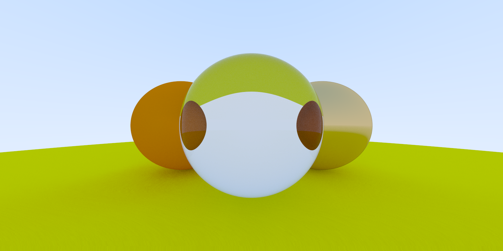

# Ray Tracer

[](https://opensource.org/licenses/MIT)
[](https://goreportcard.com/report/github.com/am-khan/ray_tracer)

A ray-tracer written in golang.

Roughly following the [Ray Tracing in One Weekend](https://markphelps.me/2016/03/15/writing-a-ray-tracer-in-go/) blog.



## Install
To install, place the package in your `go/src` folder:
```shell script
~ go get github.com/am-khan/ray_tracer/cmd/ray_tracer
```

## Usage
To run (with build):
```shell script
~ ray_tracer

Using 16 goroutines.

[================================================================================] 100.00%

Done. 
Elapsed: 25.709205942s
```

## Environment 
Currently, the environment supports spheres, aliasing and 3 types of materials:

* Lambertian
* Metallic
* Dialectric

To set up a new object, go to `configs/config.json` and specify the properties there.

 ```shell script
go build github.com/am-khan/ray_tracer/cmd/ray_tracer
```

## Outputs
Images are created at `./image.png` with the dimensions and attributes set within `configs/config.json`.


## Testing
To run the unit tests - use the built-in go test runner:  

```shell script
~ go test ./...
```
